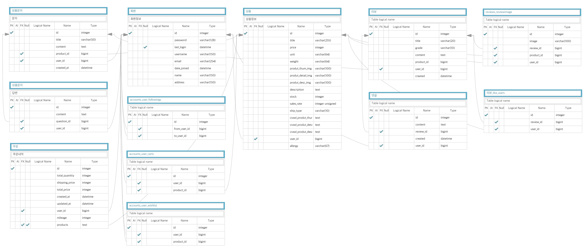
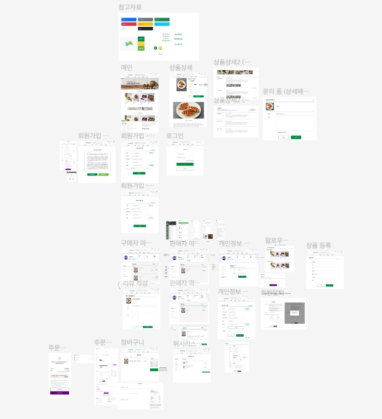
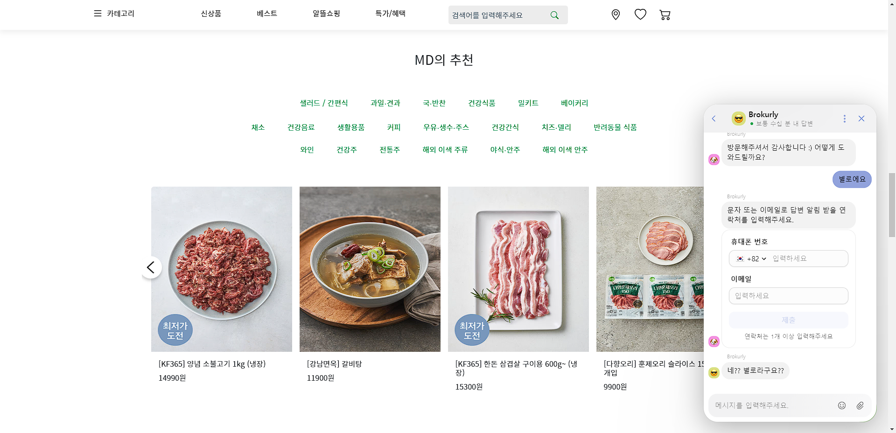

# Brokuly🥦

> 이커머스 사이트 [ Brokuly🥦] project
> 
> 

## 🔖 Table of contents

- [General info](#general-info)
- [Requirements](#requirements)
- [Modeling](#modeling)
- [Technologies](#technologies)
- [Features](#features)
- [Reviews](#reviews)

## 📜 General info

- 
- 개발기간 : 2022. 11. 09 - 2022. 11. 22
- 팀원 :  
  Front-end([김예린](https://github.com/ererink/), [임선주](https://github.com/snnzzoo/))
  Back-end([이동근](https://github.com/qlghwp123/), [이태극](https://github.com/uRo3YA/), [최준우](https://github.com/wnsn8546/))

## 🧭Requirements

- 1️⃣ 서비스에는 최소 20개의 콘텐츠 정보(여행지, 맛집, 영화, 상품)가 생성된 상태여야 합니다.
- 2️⃣ 콘텐츠 정보 & 후기 공유 커뮤니티 서비스에 필요한 최소한의 CRUD를 구현해야 합니다.
- 3️⃣ 회원 인증 기능을 구현하고, 권한에 따라 서비스 사용을 제한해야 합니다.
- 4️⃣ 사용자는 콘텐츠 또는 후기에 좋아요를 남길 수 있어야합니다.
- 5️⃣ 사용자간 팔로우를 할 수 있어야합니다.
- 6️⃣ HTML / CSS / JavaScript를 활용해서 웹 사이트를 디자인합니다.
- **7️⃣ 완성한 서비스는 배포해야하며 발표회에서는 배포된 서비스를 시연해야 합니다.**

## 🗃️Modeling

### ERD 모델

> 

### 와이어 프레임

> 

## 💻Technologies

### Technology stack

  

 

   

 

## 🔍Features

### 담당 역할

#### 이동근

- ⭐Team Leader⭐
- Back-end(Accounts App)
- 

#### 김예린

- Front-end
- 메인 페이지, 상품 메인 페이지, 상품 상세 페이지 화면 구현
- navbar 구현
- 회원가입 및 로그인, 회원탈퇴 페이지 화면 구현

#### 임선주

- Front-end
- 

#### 이태극

- Back-end (Products, Review App, Accounts 일부)
- Crawling
- Search
- Bug Fix

#### 최준우

- Back-end(Orders APP, Qnas APP)
- Social Login(Naver, KaKao) API, Social Share(Facebook, Twitter, Naver, KaKao)API
- KAKAO address search, map API, KAKAO pay API
- ID , Email duplicate check, Email verification number check
- Bug Fix

### 기능 소개

### 각 앱 기능이 분리되지 않고 유기적으로 연결

### Main Page

- Navbar
  
  > 

- Section
  
  > 각각의 섹션에서 조회기준을 통해 여러 객체 출력

### Accounts APP

- CRUD
  
  > 

### Products APP

- index 페이지
  
  > 호버로 제품별 이미지 효과

- 상세 페이지
  
  > 상품 리뷰 작성은 모달 팝업으로 제작
  > 상품 문의는 아코디언으로 확장

- 데코레이터
  
  > 데코레이터 구성으로 유저 권한(판매자/구매자)에 따른 기능 접근 제한

- CRUD
  
  > 상품 생성시 멀티셀렉트 필드를 이용한 다양한 옵션 선택 가능

- 크롤링
  
  > 크롤링을 통한 기존 상품들 대량 등록

- 페이지네이션
  
  > 페이징처리하여 상품별 출력 갯수 적절히 조절

- 검색 기능
  
  > Q 모듈을 이용한 검색기능
  > Listview를 이용한 페이지네이션

- 판매자 팔로우 기능
  
  > 비동기 통신으로구현 Accounts 앱으로 연결
  > 마이페이지의 팔로잉 목록에서 판매자의 최근 판매 상품 볼 수 있음

- 위시리스트 기능
  
  > 비동기 통신으로구현 Accounts 앱으로 연결

- 상품문의 기능
  
  > 상품별 상세 페이지에서 문의사항과 답변을 출력하며
  > 기능은 Qnas앱으로 연결

- 장바구니 기능
  
  > Orders 앱으로 연결

### Reviews APP

- CRUD
  
  > 상품 생성시 멀티셀렉트 필드를 이용한 다양한 옵션 선택 가능
  > 리뷰 모델과 분리한 이미지 모델을 이용해 하나의 리뷰에 여러 이미지 삽입

- 평점
  
  > 상품에 해당하는 리뷰 평점을 계산하여 상품 평점 반환

- 추천
  
  > 비동기 통신으로 구현

- 댓글
  
  > 비동기 통신으로 구현

### Qnas APP

- CRUD
  
  > 상품에 대한 구매자의 문의 작성, 조회, 수정, 삭제
  
  > 문의에 대한 판매자의 답변 작성, 조회, 수정, 삭제
  
  > 답변대기, 답변완료상태 표시

### Orders APP

- 주문
  
  > 카트 -> 주문서 -> 주문완료의 흐름
  
  > 카카오페이 API 를 활요한 결제 확인 테스트 구현.

## 💬Reviews

- 이동근

- 김예린

- 임선주

- 이태극
  
  > 왜 사람들이 Django에서 함수형 뷰를 안쓰고, 제네릭 뷰로 상속 받아서 쓰는지 알게되었습니다.  특히 마이페이지 구현이나, 검색의 경우 이전 페이지에서 값들 불러온 상태에서 렌더링이 되야 하는데  일반 함수형 뷰를 쓸 경우 context에 많은양을 집어넣어야 해서 다른 코드를 재활용하기 힘들었습니다.

- 최준우
  
  > 이전 프로젝트에서 하고 싶었던 다양한 API들을 사용해볼 수 있었던 기회였고, 주문, 이메일인증등의 기능흐름을 살펴보고 해당 기능을 구현할 수 있는 다양한 방법들을 찾아 볼 수 있었습니다.  다음 프로젝트에서는 이번 프로젝트의 경험을 바탕으로 DRF등을 활용하여 직접 API서버도 구축해봐야겠다는 생각이 들었습니다.  감사합니다.
